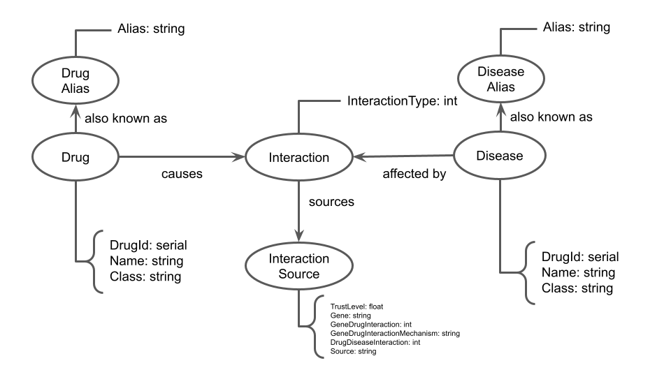

# Aluno

* `241599`: `Mateus Siqueira Batista`

## Modelo lógico do Banco de Dados de Grafos

## Perguntas de pesquisa/análise

1. Qual grupo de drogas tem relação com a doença X?
2. Qual a principal classe de doenças relacioda à droga Y?
3. Com qual frequência uma droga Y aparece em interações?
4. Algum tipo de interação é mais frequente para uma droga ou doença?